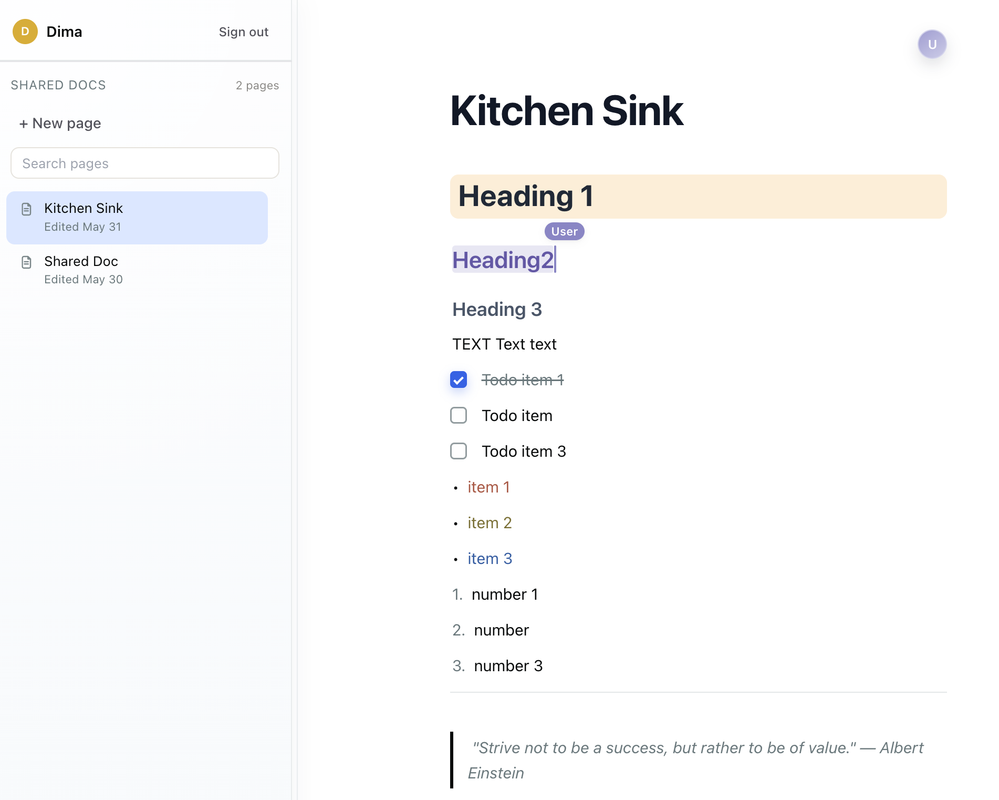
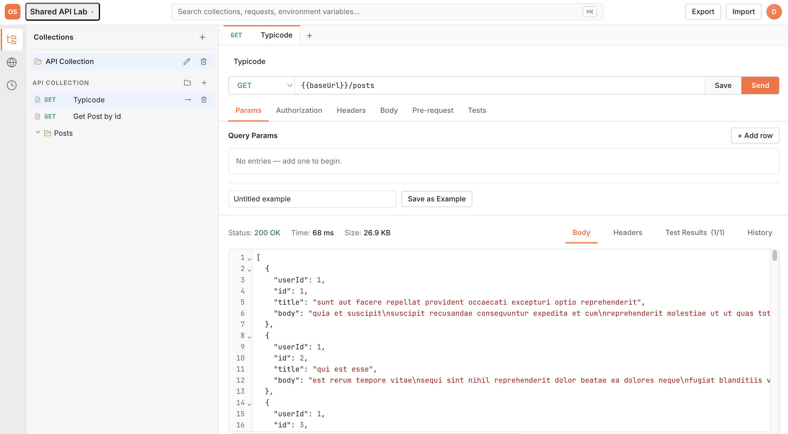

# OrbitStack

OrbitStack is a Cloudflare Workers framework where Durable Objects are actors, HTTP controllers orchestrate them, and `@OrbitApp` is the composition root.

## Quick setup

Paste this into any AI coding agent to install OrbitStack agent tooling in one step.

```bash
Fetch https://raw.githubusercontent.com/ddoronin/orbit/refs/heads/main/agent-setup/prompt.md
```

## Demo

Try the live Notion-style example app: [Orbit Notion Demo](https://orbit-notion.doronindm.workers.dev/).



Try the live Postman-style example app: [Orbit Postman Demo](https://orbit-postman.doronindm.workers.dev/).



## Start Here

- Build apps with `@orbitstack/app`.
- Use `packages/example-notion` as the canonical reference implementation.
- Keep app wiring centralized in one `@OrbitApp({ ... })` declaration.
- For tests, prefer `@orbitstack/testing` helpers (`createTestActor`, `createTestContainer`).

## Quick App Checklist

1. Create actor/controller/service classes.
2. Register them in `@OrbitApp({ actors, controllers, providers })`.
3. If you add an actor, also:
   - add wrangler Durable Object binding and migration
   - export DO class from worker entry (`export const { Name } = worker`)
4. Keep TypeScript ESM imports with `.js` suffix in source files.

## WebSocket Choice

- Use actor WebSockets (`{ type, payload }`) for simple actor message dispatch.
- Use `@orbitstack/channels` (Phoenix shape `{ event, topic, payload, ref }`) for topic/join/reply semantics.

## Package Guidance

Default rule: start with `@orbitstack/app` and add `@orbitstack/testing` for tests. Drop to lower-level packages only when your use case needs direct control.

### Package Decision Matrix

| If you are doing this                                        | Preferred package      | Why                                                                                                      |
| ------------------------------------------------------------ | ---------------------- | -------------------------------------------------------------------------------------------------------- |
| Building an Orbit app (actors + controllers + worker wiring) | `@orbitstack/app`      | Umbrella package with decorators, DI tokens, and `createWorker(App)` in one import surface.              |
| Writing tests for actors/controllers                         | `@orbitstack/testing`  | Purpose-built helpers like `createTestActor` and `createTestContainer` keep tests small and explicit.    |
| Implementing actor internals directly                        | `@orbitstack/actors`   | Direct access to `OrbitActor`, actor metadata, registry, and DO composition helpers.                     |
| Building custom HTTP router/controller behavior              | `@orbitstack/http`     | Router, middleware/guard/pipe pipeline, and controller decorators without app-level wrapper assumptions. |
| Using Phoenix-style channels over WebSocket                  | `@orbitstack/channels` | Event/topic/reply semantics for richer socket workflows than raw actor message frames.                   |
| Producing or consuming Cloudflare Queues                     | `@orbitstack/queues`   | Queue decorators, producer helpers, and queue handler wiring for Worker `queue()` entrypoints.           |
| Working with storage wrappers or storage token patterns      | `@orbitstack/storage`  | Storage-focused utilities for D1/KV/R2 integration patterns.                                             |
| Generating wrangler/worker wiring at build time              | `@orbitstack/build`    | Codegen for bindings and worker entry artifacts used by CLI/build flows.                                 |
| Scaffolding and validating projects from terminal commands   | `@orbitstack/cli`      | `orbitstack new`, `orbitstack build`, strict wiring checks, and optional generated wiring apply mode.    |
| Extending DI container or framework internals                | `@orbitstack/core`     | Lowest-level tokens/container/factory APIs for advanced extension work.                                  |

When unsure, copy the closest working pattern from `packages/example-notion` before adding lower-level package imports.

## AI Agents

- First-run setup prompt: see `agent-setup/prompt.md`.
- Workspace prompt for prompt-aware agents: `.github/prompts/orbitstack-agent-setup.prompt.md`.
- Repo guidance: see `AGENTS.md`.
- Cursor users: repo rules are in `.cursor/rules/`.
- Installable Orbit skill: copy `.cursor/skills/orbitstack/` into your project or into `~/.cursor/skills/orbitstack/`.
- OrbitStack does not currently publish an MCP server suite; use docs, prompt files, and local rules instead.
